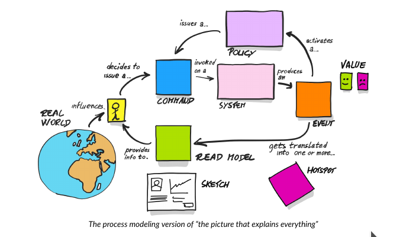
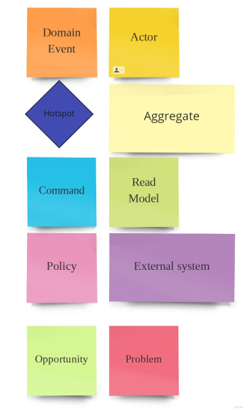

## Table of contents
- [Table of contents](#table-of-contents)
- [Intro](#intro)
- [Domain description](#domain-description)
- [Domain exploration](#domain-exploration)
  - [Big Picture Event Storming](#big-picture-event-storming)

## Intro
This is a project of Airline Reservation System(ARS) - software application to assist an airline with transactions related to :
* ticket reservations
* canceling and rescheduling tickets.

It has been  implemented for educational purposes using techniques derived from the domain of DDD.

## Domain description
The main purpose of the application is to support an airline customer with processes:
* checking availability
* making tickets reservations (blocking,reserving)
* cancelling tickets  
* rescheduling reservations.

**Checking availability**

At this stage, the customer enters basic information about their preferences and receives information about 
flight options.

The customer should set his preferences :
* departure date/time (one value or range)
* origin city
* arrival city
* class
* one-way or round trip
* departure date 
* number of passangers (adult/children/senior)

And should get list of flights that meet the criteria. 

Single flight information should have:
* the flight number
* departure time in origin city
* arrival time in destination city
* the duration of the flight (taking into account the possibility of a change of time zone) 
* the number of seats available on that flight.

This list can be the basis for making a ticket reservation.

 **Ticket reservation**
 
 //todo
 

## Domain exploration
### Big Picture Event Storming
#### Event Storming Grammar
##### The picture that explains everything
This nice picture comes from [Introducing EventStorming-Alberto Brandolini](https://leanpub.com/introducing_eventstorming).

 

##### Sticky notes
 

#### First domain exploration 
##### Step one - unordered events (under construction)
