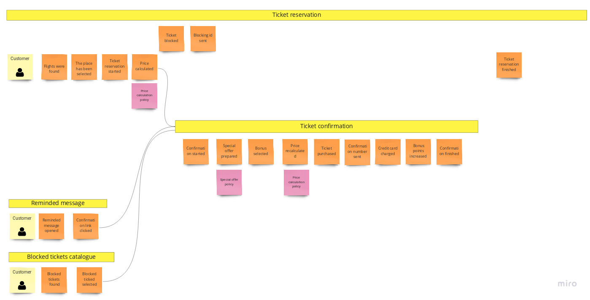
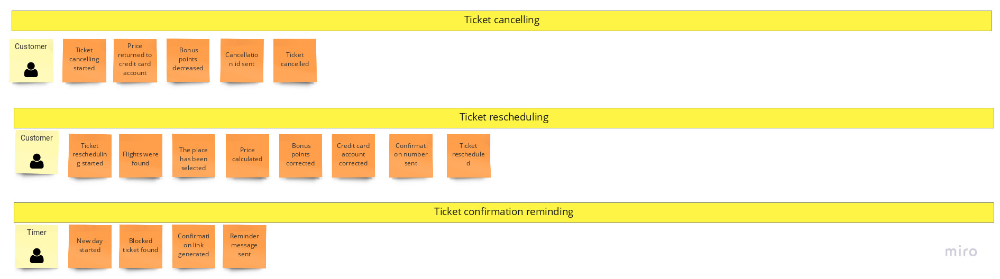

## Table of contents
- [Table of contents](#table-of-contents)
- [Intro](#intro)
- [Domain description](#domain-description)
- [Domain exploration](#domain-exploration)
  - [Big Picture Event Storming](#big-picture-event-storming)

## Intro
This is a project of Airline Reservation System(ARS) - software application to assist an airline with transactions related to :
* making ticket reservations
* canceling and rescheduling tickets.

It has been  implemented for educational purposes using techniques derived from the domain of DDD.

## Domain description
The main purpose of the application is to support an airline customer with processes:
* checking availability
* making tickets reservations (blocking,reserving)
* cancelling tickets  
* rescheduling reservations.

**Loyality programs**

Using airline services involves granting the user bonus points. Each dollar spent adds up 10 bonus points. 

**Checking availability**

The ticket reservation process begins with checking information on available flights. The customer sets his preferences (departure date/time,origin city
,arrival city, class,one-way or two-way trip, departure date, number and type (adult/senior/children) of passangers) and gives information about available
fligths (the flight number,departure time in origin city,arrival time in destination city,the duration of the flight, the number of seats available on
that flight).

**Ticket reservation**

It is necessary to provide flight number and seat number to reserve a seat. 
If the difference between the departure date and system date is more than 2 weeks, the ticket is blocked without no cost. 
Customer should make a make the final purchase of the ticket before 2 weeks of the departure date. 3 weeks before the date of departure, system should
send to the customer reminder message.

If the difference between today's date and departure date is less than 2 weeks, there is no possibility to block the ticket, it must be bought. 

While the ticket is blocked, its price may change. After purchasing a ticket, its price cannot change.

If at the time of purchase the user has 7000 bonus points, he has the right to choose a place in business class (if available). 

If at the time of purchase, the customer has 500 bonus points he is entitled to take 1 piece of luggage.

After purchasing the ticket,the customer's credit card is charged. The customer receives a mail message with his confirmation number. 

The number of bonus points will be increased.

**Ticket price calculation**

A initial price is determined for each seat on the plane. It has an auxiliary character and is not presented to the client.The final  ticket price is
 calculated on the basis of many different factors that increase or decrease the initial price.

* if the reservation is made more than 4 months before the departure date, the initial price should be reduced by 60%
* if the reservation is made between 2-4 months before the departure date, the initial price should be reduced by 40%
* if the reservation is made two months before the check-in time, the initial price should be reduced by 20%
* if the reservation is made at most one month before departure, the initial price must be increased by 20%
* if the reservation day falls on Tuesday or Wednesday, the starting price can be reduced by 20%
* if 85% of seats have been sold for a given flight, the ticket price may be reduced by 10%
* if less than 85% of seats have been sold for a given flight, the ticket price must be increased by 20%

Discounts can accumulate but they can be up to 70% initial price.

**Rescheduling ticket**

Ticket rescheduling based on confirmation number. It is possible only for confirmed tickets. Blocked ticket can't be rescheduled.
If there is any difference in the prices of the tickets, it is returned to the credit card account. New confirmation number is sent to the customer via email.

**Cancelling ticket**

Both blocked and confirmed tickets can be cancelled. To cancel the ticket it is required to provide the blocking id or confirmation id.  If the ticket has
 been confirmed, cancellation will result in a reduction of 25% of the price. 

If a canceled ticket has already been bought, the number of bonus points should be decreased.

## Domain exploration
### Big Picture Event Storming
The main goal of this stage of domain exploration process is to divide the problem into smaller independent parts. To find them, we can use few main
 heuristics:
 
* organization structure
* domain experts
* ubiquitous language
* bussiness value
* business process 

#### Event Storming Grammar
##### The picture that explains everything
This nice picture comes from [Introducing EventStorming-Alberto Brandolini](https://leanpub.com/introducing_eventstorming).

 

##### Sticky notes
 

#### Airline Reservation System - domain exploration - Big Picture 

##### Step one - unordered events

##### Step two - events arranged on timeline

At this stage, the events have been arranged in a timeline and ordered. Some of them have been refined and replaced with several new ones.

##### Step three - subdomains

