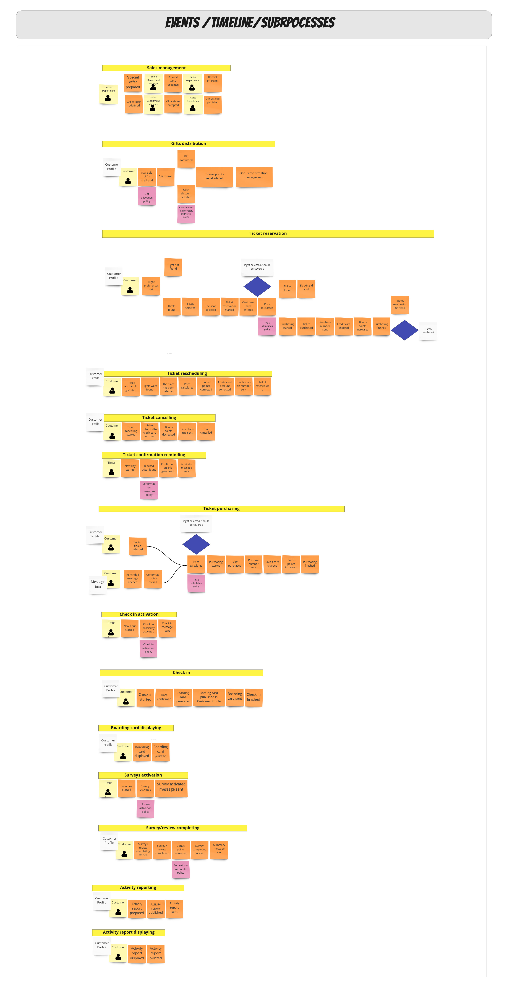
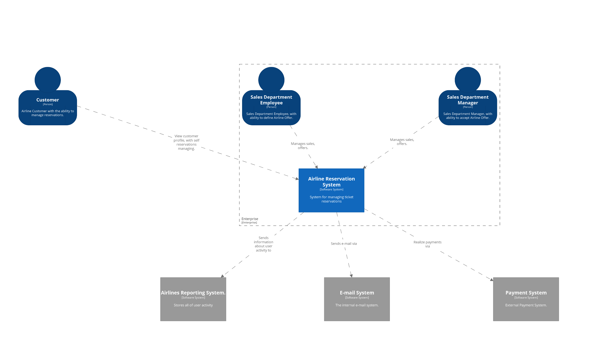
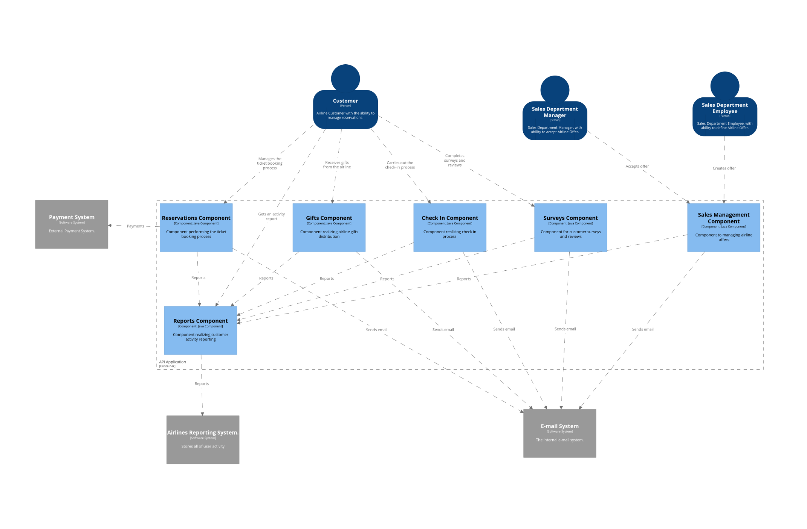

## Table of contents
- [Table of contents](#table-of-contents)
- [Intro](#intro)
- [Domain description](#domain-description)
- [Domain exploration](#domain-exploration)
  - [Event Storming Grammar](#event-storming-grammar)
    - [The picture that explains everything](#the-picture-that-explains-everything)
    - [Sticky notes](#sticky-notes)
  - [Airline Reservation System - domain exploration - Big Picture](#airline-reservation-system---domain-exploration---big-picture)
    - [Unordered events](#unordered-events)
    - [Events arranged on timeline](#events-arranged-on-timeline)
    - [Subdomains](#subdomains)
  - [Airline Reservation System - domain exploration - Process Level Event Storming](#airline-reservation-system---domain-exploration---process-level-event-storming)
    - [Bounded Contexts](#bounded-contexts)
- [Architecture](#architecture)
  - [Overview](#overview)
  - [C4 Architecture diagrams](#c4-architecture-diagrams)
    - [C1- Software System Perspective](#c1--software-system-perspective)
    - [C2- Container Perspective](#c2--container-perspective)
    - [C3- Component Perspective](#c3--component-perspective)


## Intro
This is a project of Airline Reservation System(ARS) - software application to assist an airline with transactions related to :
* making ticket reservations
* canceling and rescheduling tickets.

It has been  implemented for educational purposes using techniques derived from the domain of DDD.


## Domain description
The main purpose of the application is to support an airline customer with processes:
* checking availability
* making tickets reservations (blocking,reserving)
* cancelling tickets  
* rescheduling reservations.

**Loyality program**

Using airline services involves granting the user bonus points. Each dollar spent adds up 10 bonus points. 
The user can exchange the accumulated bonus points for the indicated discounts and privileges. They will be included in the next booking. 

* If the user has 500 to 1000 points, he can use a more extensive menu.
* If the user has 1000 to 3000 points, he is entitled to take 1 piece of luggage.
* If the user has 3000 to 5000 points, he has the right to choose a place in business class (if available). 

Each of the privileges can be exchanged for a cash discount (2% from the base ticket price for every 1000 points)

The gifts catalog is managed by the Sales Department. 

**Checking availability**

The ticket reservation process begins with checking information on available flights. The customer sets his preferences (departure date/time,origin city
,arrival city, class,one-way or two-way trip, departure date, number and type (adult/senior/children) of passangers) and gives information about available
fligths (the flight number,departure time in origin city,arrival time in destination city,the duration of the flight, the number of seats available on
that flight).

**Ticket reservation**

It is necessary to provide flight number and seat number to reserve a seat. 
If the difference between the departure date and system date is more than 2 weeks, the ticket is blocked without no cost. 
Customer should make a make the final purchase of the ticket before 2 weeks of the departure date. 3 weeks before the date of departure, system should
send to the customer reminder message.

If the difference between today's date and departure date is less than 2 weeks, there is no possibility to block the ticket, it must be bought. 

While the ticket is blocked, its price may change. After purchasing a ticket, its price cannot change.

After purchasing the ticket,the customer's credit card is charged. The customer receives a mail message with his confirmation number. 

The number of bonus points will be increased.

**Ticket price calculation**

A initial price is determined for each seat on the plane. It has an auxiliary character and is not presented to the client.The final  ticket price is
 calculated on the basis of many different factors that increase or decrease the initial price.

* if the reservation is made more than 4 months before the departure date, the initial price should be reduced by 60%
* if the reservation is made between 2-4 months before the departure date, the initial price should be reduced by 40%
* if the reservation is made two months before the check-in time, the initial price should be reduced by 20%
* if the reservation is made at most one month before departure, the initial price must be increased by 20%
* if the reservation day falls on Tuesday or Wednesday, the starting price can be reduced by 20%
* if 85% of seats have been sold for a given flight, the ticket price may be reduced by 10%
* if less than 85% of seats have been sold for a given flight, the ticket price must be increased by 20%

Discounts can accumulate but they can be up to 70% initial price.

**Rescheduling ticket**

Ticket rescheduling based on confirmation number. It is possible only for confirmed tickets. Blocked ticket can't be rescheduled.
If there is any difference in the prices of the tickets, it is returned to the credit card account. New confirmation number is sent to the customer via email.

**Cancelling ticket**

Both blocked and confirmed tickets can be cancelled. To cancel the ticket it is required to provide the blocking id or confirmation id.  If the ticket has
 been confirmed, cancellation will result in a reduction of 25% of the price. 

If a canceled ticket has already been bought, the number of bonus points should be decreased.

**Check in**

 The user can perform an automatic check-in. It is possible not earlier than 10 hours before the departure time . 
 This option is available in a Customer Profile. During the check-in process a boarding card is generated. After generating it is available from Customer
  Profile.

**Customer Satisfaction Surveys**

After each flight, the user receives an e-mail with information that he can complete the survey satisfied and write a review.  This results in additional
 bonus points (500 - survey, 1000 review). Flights to evaluate are presented in the user's profile. 

**Special offers** 

The Sales Department sends information about special offers prepared for customers. After entering the offer, it is published by email.
                                                                                                                     
**Reporting system**

Reporting Department collects all activity events. They allow to recreate the entire activity history for each user.Each user can request to prepare such a
 report.


## Domain exploration

### Event Storming Grammar
#### The picture that explains everything
This nice picture comes from [Introducing EventStorming-Alberto Brandolini](https://leanpub.com/introducing_eventstorming).

 

#### Sticky notes
 


### Airline Reservation System - domain exploration - Big Picture 

The main goal of Big Picture Event Storming is to divide the problem into smaller business parts, that can be analyzed independently.

To identify them, we can use few heuristics:
 
* **Organization Structure** - The first approximation in the process of extracting subdomains is to look at organizational boundaries .  We can try to mark
 process steps and assign them to the units in which they take place.
* **Domain Experts** - Sometimes in one organizational unit there are people who deal with different kind of problems.  This can affect the creation of separate
 subdomains.
* **Domain Expert Language** - We must pay attention to the meaning of the words used by experts. For different experts,  different behaviors of the same
 thing matter.
* **Bussiness Value** - If part of the system has a higher business value than others, a separate subdomain should be separated for it. 
* **Business Process** -  Sometimes, at some point in the process, other business rules come into effect. This may be the basis for separating a separate
  subdomain for this step.

At this stage we describe the current state of the process and try to identify its weaknesses. We are not optimizing yet.

#### Unordered events


#### Events arranged on timeline
At this stage, the events have been arranged in a timeline and ordered. Some of them have been refined and replaced with several new ones.

<a href="https://raw.githubusercontent.com/mwwojcik/airline-reservation-system/master/img/ars-big-picture-events-timeline.jpg" target="_blank">Show picture
</a>


#### Subdomains

<a href="https://raw.githubusercontent.com/mwwojcik/airline-reservation-system/master/img/ars-big-picture-subdomains-poster.jpg" target="_blank">Show picture
</a>


### Airline Reservation System - domain exploration - Process Level Event Storming 

Process Level is the next stage of Event Storming.  As a result, previously discovered subdomains are mapped to the solution space. 
The result of this mapping are Bounded Contexts.  

 

| *Subdomain is a part of the domain, and a bounded context is a part of the solution.*      |
| ----------- |

 

At this stage a new process flow is designed and optimizations are introduced. 

The main heuristics determining number and the scope of the separated Bounded Context are:

* **Context Autonomy** - The most important question is whether our context is completely independent of others.
* **Number of contexts in the business process** - Processes should be designed in such a way that they intersect as few bounded as possible. Fewer
 contexts result in less need for integration. This gives more autonomy for contexts.
* **Shared information** - If any data needs to change immediately in more than one bounded context, it means that the boundaries were set incorrectly.
* **Communication with others** - Context should contain most of the data he needs. Communication with other contexts should be kept to a minimum. We have to
 ask ourselves why integration has occurred. Integration with external systems is very expensive. We must be sure it is necessary.  
* **Context responsibility** - Each context should have a well defined range scope. If this description is complicated and consists of many sentences,
 it is very likely that the context boundaries are too wide.
* **The only one source of information** - Every important information should have one context which is the source of its value. If it is shared, maybe one
 more dedicated context should be created.
* **Is the context not schizophrenic** - It is a situation when the context needs to find out what part of the process it is currently implementing. 
In this case, the code appears:
```
if(isSingleUserProcess()){
    //do something
} else {
    //do something else
}
```

#### Bounded Contexts

<a href="https://raw.githubusercontent.com/mwwojcik/airline-reservation-system/master/img/ars-big-picture-subdomains-bc-poster.jpg" target="_blank">Show picture
</a>


## Architecture

### Architectural Decision Log

|Number|Date|Type|Title&nbsp;&nbsp;&nbsp;&nbsp;&nbsp;&nbsp;&nbsp;&nbsp;&nbsp;&nbsp;&nbsp;&nbsp;&nbsp;&nbsp;&nbsp;&nbsp;&nbsp;&nbsp;&nbsp;&nbsp;|Status|
|:-|:-|:-|:-|:-|
|0001|2020-04-19|SYS|[Use Modular Monolith](ars/0001-sys-use-modular-monolith.md)|Accepted|

### C4 Architecture diagrams 

#### C1- Software System Perspective

<a href="https://raw.githubusercontent.com/mwwojcik/airline-reservation-system/master/img/architecture/structurizr-52510-SystemLandscape-001.png" target="_blank">Show picture</a>

<!---->

#### C2- Container Perspective

<a href="https://raw.githubusercontent.com/mwwojcik/airline-reservation-system/master/img/architecture/structurizr-52510-Containers.png" target="_blank">Show picture</a>

<!---->

#### C3- Component Perspective

<a href="https://raw.githubusercontent.com/mwwojcik/airline-reservation-system/master/img/architecture/structurizr-52510-Components.png" target="_blank">Show picture</a>

<!---->

