## Table of contents
- [Intro](#intro)
- [Domain description](#domain-description)
- [Domain exploration](#domain-exploration)
  - [Event Storming Grammar](#event-storming-grammar)
    - [The picture that explains everything](#the-picture-that-explains-everything)
    - [Sticky notes](#sticky-notes)
  - [Airline Reservation System - domain exploration - Big Picture](#airline-reservation-system---domain-exploration---big-picture)
    - [Unordered events](#unordered-events)
    - [Events arranged on timeline](#events-arranged-on-timeline)
    - [Subdomains](#subdomains)
  - [Airline Reservation System - domain exploration - Process Level Event Storming](#airline-reservation-system---domain-exploration---process-level-event-storming)
    - [Bounded Contexts](#bounded-contexts)
    - [Commands / Read Model](#commands--read-model)
- [Architecture](#architecture)
  - [Architectural Decision Log](#architectural-decision-log)
  - [C4 Architecture diagrams](#c4-architecture-diagrams)
    - [C1- Software System Perspective](#c1--software-system-perspective)
    - [C2- Container Perspective](#c2--container-perspective)
    - [C3- Component Perspective](#c3--component-perspective)
- [Bounded context exploration](#bounded-context-exploration)
  - [Airline Reservation System - bounded context exploration - Design Level Event Storming](#airline-reservation-system---bounded-context-exploration---design-level-event-storming)
    - [Lack of Cohesion](#lack-of-cohesion)
- [Implementation (Reservation module)](#implementation-reservation-module)
  - [Ports and Adapters (Hexagonal Architecture)](#ports-and-adapters-hexagonal-architecture)
  - [Non-functional requirements](#non-functional-requirements)
  - [Application services](#application-services)
  - [Spring Boot Configuration](#spring-boot-configuration)


## Intro
This is a project of Airline Reservation System(ARS) - software application to assist an airline with transactions related to :
* making ticket reservations
* canceling and rescheduling tickets.

It has been  implemented for educational purposes using techniques derived from the domain of DDD.


## Domain description
The main purpose of the application is to support an airline customer with processes:
* checking availability
* making tickets reservations (blocking,reserving)
* cancelling tickets  
* rescheduling reservations.

**Loyality program**

Using airline services involves granting the user bonus points. Each dollar spent adds up 10 bonus points. 
The user can exchange the accumulated bonus points for the indicated discounts and privileges. They will be included in the next booking. 

* If the user has 500 to 1000 points, he can use a more extensive menu.
* If the user has 1000 to 3000 points, he is entitled to take 1 piece of luggage.
* If the user has 3000 to 5000 points, he has the right to choose a place in business class (if available). 

Each of the privileges can be exchanged for a cash discount (2% from the base ticket price for every 1000 points)

The gifts catalog is managed by the Sales Department. 

**Checking availability**

The ticket reservation process begins with checking information on available flights. The customer sets his preferences (departure date/time,origin city
,arrival city, class,one-way or two-way trip, departure date, number and type (adult/senior/children) of passangers) and gives information about available
fligths (the flight number,departure time in origin city,arrival time in destination city,the duration of the flight, the number of seats available on
that flight).

**Ticket reservation**

Via the online booking system, the customer can reserve a maximum of 10 individual tickets per month. Before making the reservation, the system checks whether
 the user has exceeded the limit .

It is necessary to provide flight number and seat number to reserve a seat. 
If the difference between the departure date and system date is more than 2 weeks, the ticket is blocked without no cost. 
Each customer can have only 3 blocked reservations at a time. Each subsequent ticket must be confirmed immediately.

Customer should make a make the final purchase of the ticket before 2 weeks of the departure date. 3 weeks before the date of departure, system should
send to the customer reminder message.

If the difference between today's date and departure date is less than 2 weeks, there is no possibility to block the ticket, it must be bought. 

While the ticket is blocked, its price may change. After purchasing a ticket, its price cannot change.

After purchasing the ticket,the customer's credit card is charged. The customer receives a mail message with his confirmation number. 

The number of bonus points will be increased.

**Ticket price calculation**

A initial price is determined for each seat on the plane. It has an auxiliary character and is not presented to the client.The final  ticket price is
 calculated on the basis of many different factors that increase or decrease the initial price.

**Calculations made on the day of rezervation:**
* if the reservation is made more than 4 months before the departure date, the initial price should be reduced by 60%
* if the reservation is made between 2-4 months before the departure date, the initial price should be reduced by 40%
* if the reservation is made two months before the departure date, the initial price should be reduced by 20%
* if the reservation takes place in the same month as the departure date the initial price should be increased by 10%


**Calculations performed on the day of sale (confirm)**

* if the current day falls on Tuesday or Wednesday, the starting price can be reduced by 20%
* if 85% of seats have been sold for a given flight, the ticket price may be reduced by 10%
* if less than 85% of seats have been sold for a given flight, the ticket price must be increased by 10%

This type of discounts can accumulate.

**Rescheduling ticket**

Ticket rescheduling based on confirmation number. It is possible only for confirmed tickets. Blocked ticket can't be rescheduled.
If there is any difference in the prices of the tickets, it is returned to the credit card account. New confirmation number is sent to the customer via email.
Changing the reservation date can be done only twice. After the limit has been used, the reservation must be canceled.

**Cancelling ticket**

Both blocked and confirmed tickets can be cancelled. To cancel the ticket it is required to provide the blocking id or confirmation id.  If the ticket has
 been confirmed, cancellation will result in a reduction of 25% of the price. 

If a canceled ticket has already been bought, the number of bonus points should be decreased.

**Check in**

 The user can perform an automatic check-in. It is possible not earlier than 10 hours before the departure time . 
 This option is available in a Customer Profile. During the check-in process a boarding card is generated. After generating it is available from Customer
  Profile.

**Customer Satisfaction Surveys**

After each flight, the user receives an e-mail with information that he can complete the survey satisfied and write a review.  This results in additional
 bonus points (500 - survey, 1000 review). Flights to evaluate are presented in the user's profile. 

**Special offers** 

The Sales Department sends information about special offers prepared for customers. After entering the offer, it is published by email.
                                                                                                                     
**Reporting system**

Reporting Department collects all activity events. They allow to recreate the entire activity history for each user.Each user can request to prepare such a
 report.


## Domain exploration

### Event Storming Grammar
#### The picture that explains everything
This nice picture comes from [Introducing EventStorming-Alberto Brandolini](https://leanpub.com/introducing_eventstorming).

 

#### Sticky notes
 


### Airline Reservation System - domain exploration - Big Picture 

The main goal of Big Picture Event Storming is to divide the problem into smaller business parts, that can be analyzed independently.

To identify them, we can use few heuristics:
 
* **Organization Structure** - The first approximation in the process of extracting subdomains is to look at organizational boundaries .  We can try to mark
 process steps and assign them to the units in which they take place.
* **Domain Experts** - Sometimes in one organizational unit there are people who deal with different kind of problems.  This can affect the creation of separate
 subdomains.
* **Domain Expert Language** - We must pay attention to the meaning of the words used by experts. For different experts,  different behaviors of the same
 thing matter.
* **Bussiness Value** - If part of the system has a higher business value than others, a separate subdomain should be separated for it. 
* **Business Process** -  Sometimes, at some point in the process, other business rules come into effect. This may be the basis for separating a separate
  subdomain for this step.

At this stage we describe the current state of the process and try to identify its weaknesses. We are not optimizing yet.

#### Unordered events


#### Events arranged on timeline
At this stage, the events have been arranged in a timeline and ordered. Some of them have been refined and replaced with several new ones.

<a href="https://raw.githubusercontent.com/mwwojcik/airline-reservation-system/master/img/ars-big-picture-events-timeline.jpg" target="_blank">Show picture
</a>


#### Subdomains

<a href="https://raw.githubusercontent.com/mwwojcik/airline-reservation-system/master/img/ars-big-picture-subdomains-poster.jpg" target="_blank">Show picture
</a>


### Airline Reservation System - domain exploration - Process Level Event Storming 

Process Level is the next stage of Event Storming.  As a result, previously discovered subdomains are mapped to the solution space. 
The result of this mapping are Bounded Contexts.  

 

| *Subdomain is a part of the domain, and a bounded context is a part of the solution.*      |
| ----------- |

 

At this stage a new process flow is designed and optimizations are introduced. 

The main heuristics determining number and the scope of the separated Bounded Context are:

* **Context Autonomy** - The most important question is whether our context is completely independent of others.
* **Number of contexts in the business process** - Processes should be designed in such a way that they intersect as few bounded as possible. Fewer
 contexts result in less need for integration. This gives more autonomy for contexts.
* **Shared information** - If any data needs to change immediately in more than one bounded context, it means that the boundaries were set incorrectly.
* **Communication with others** - Context should contain most of the data he needs. Communication with other contexts should be kept to a minimum. We have to
 ask ourselves why integration has occurred. Integration with external systems is very expensive. We must be sure it is necessary.  
* **Context responsibility** - Each context should have a well defined range scope. If this description is complicated and consists of many sentences,
 it is very likely that the context boundaries are too wide.
* **The only one source of information** - Every important information should have one context which is the source of its value. If it is shared, maybe one
 more dedicated context should be created.
* **Is the context not schizophrenic** - It is a situation when the context needs to find out what part of the process it is currently implementing. 
In this case, the code appears:
```
if(isSingleUserProcess()){
    //do something
} else {
    //do something else
}
```

#### Bounded Contexts

<a href="https://raw.githubusercontent.com/mwwojcik/airline-reservation-system/master/img/ars-big-picture-subdomains-bc-poster.jpg" target="_blank">Show picture
</a>
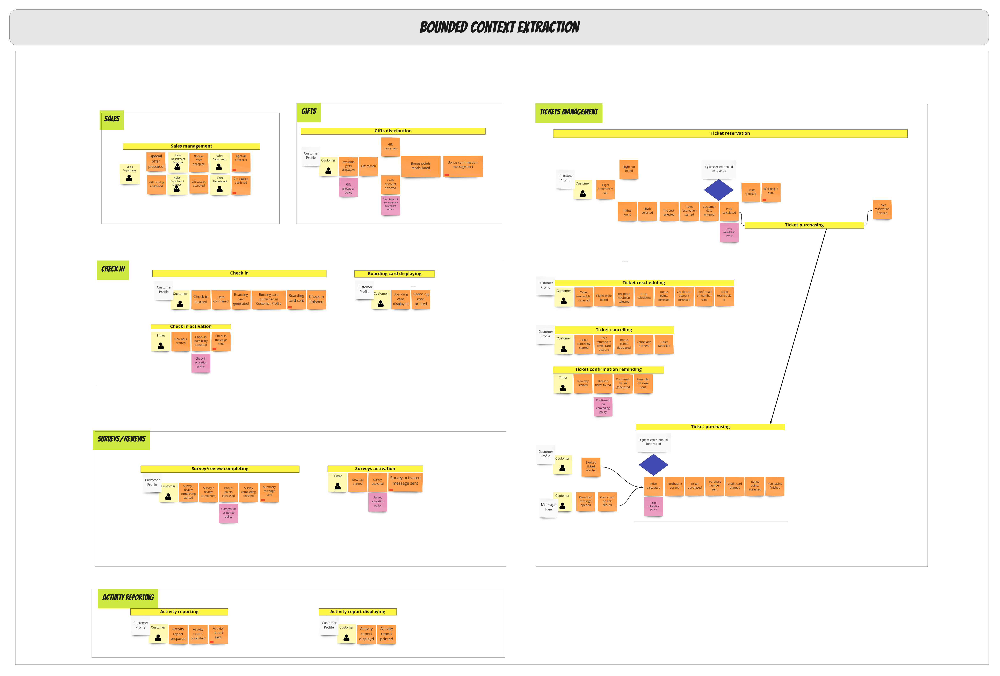


#### Commands / Read Model

<a href="https://raw.githubusercontent.com/mwwojcik/airline-reservation-system/master/img/ars-process-level-finish-1.jpg" target="_blank">Show picture
</a>


<a href="https://raw.githubusercontent.com/mwwojcik/airline-reservation-system/master/img/ars-process-level-finish-2.jpg" target="_blank">Show picture
</a>


## Architecture

### Architectural Decision Log

|Number|Type|Date|Title
|:-|:-|:-|:-|
|0002|TCH-RES|2020-05-02|[Use modular monolith](ars/0002-TCH-RES-use-modular-monolith.md)|
|0003|TCH-RES|2020-05-02|[Use Ports and Adapters architecture](ars/0003-TCH-RES-use-ports-and-adapters-architecture.md)|
|0004|TCH-RES|2020-05-02|[Use document database as a aggregate data repository](ars/0004-TCH-RES-use-document-database-as-a-aggregate-data-repository.md)|
|0005|TCH-RES|2020-05-02|[Use Spring Repository](ars/0005-TCH-RES-use-spring-repository.md)|


### C4 Architecture diagrams 

#### C1- Software System Perspective

*The perspective shows the surroundings of the created system . This diagram shows external systems and actors discovered during the session ES.*
*Internal actors are part of the organization. Externals Actors only use the system.*

<a href="https://raw.githubusercontent.com/mwwojcik/airline-reservation-system/master/img/architecture/ARS_Context.png" target="_blank">Show picture</a>
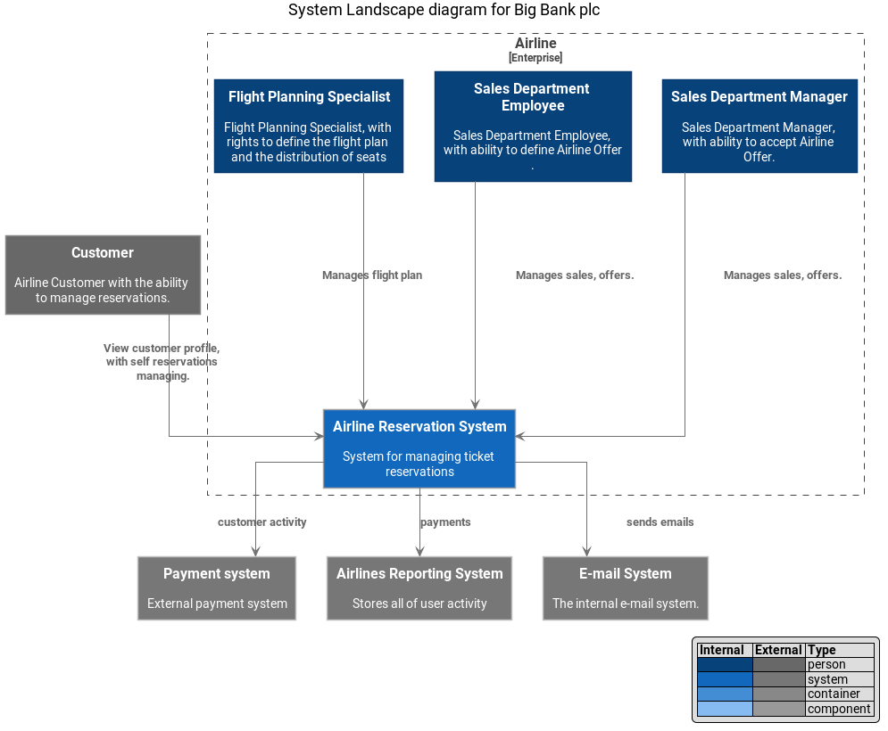

#### C2- Container Perspective

*The natural consequence of choosing modular monolith architecture is that all modules will be located in one container (API Application).*
*The diagram shows the other internal used containers (DB/SPA/WebServer/Mobile App). All of them are part of one system.*

<a href="https://raw.githubusercontent.com/mwwojcik/airline-reservation-system/master/img/architecture/ARS_Containers.png" target="_blank">Show picture</a>
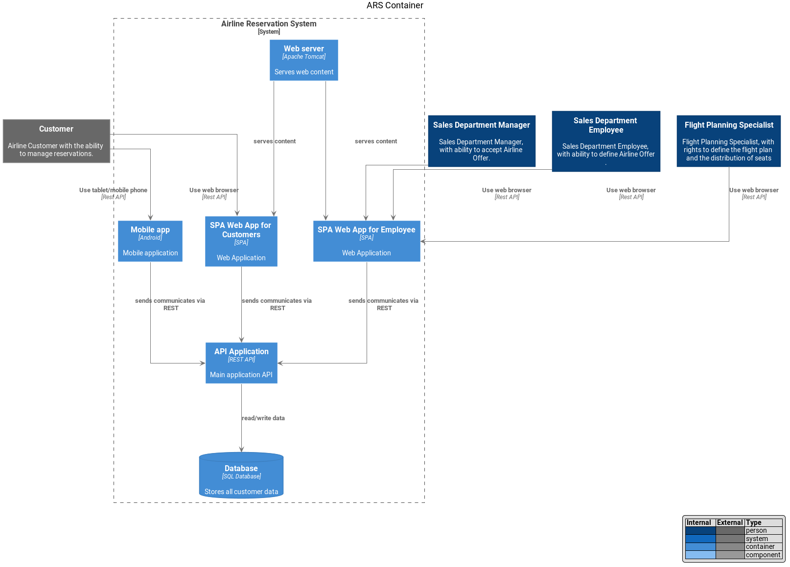

#### C3- Component Perspective

*At this level of visualization we can see all modules based on bounded context extracted during the session ES.*

<a href="https://raw.githubusercontent.com/mwwojcik/airline-reservation-system/master/img/architecture/ARS_Components.png" target="_blank">Show picture</a>
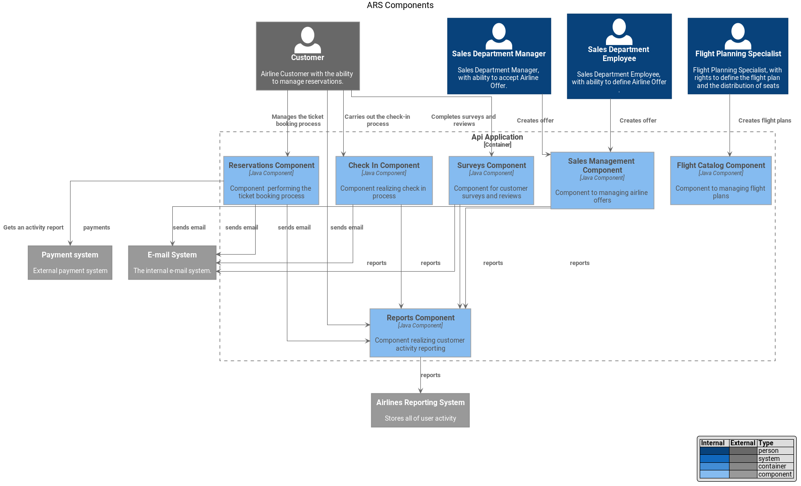

## Bounded context exploration
 
### Airline Reservation System - bounded context exploration - Design Level Event Storming

Design Level Event Storming is a technique for discovering the complexity of a closed business area - a single bounded context. 
This process focused on vertical exploration of the area. Its purpose is to discover existing business rules. 

This technique should be applied to bounded contexts with complex business logic .  

In the case of Airline Reservation System this process will be carried out for core domain business context - ticket management. This is the place where we
 expect complex business rules. 

<a href="https://raw.githubusercontent.com/mwwojcik/airline-reservation-system/master/img/air-design-level-ticket-management-init.jpg" target="_blank">Show picture</a>
  

During the session it turned out that it is necessary to redefine Gifts Bounded Context boundaries. Information about the exchange of a gift for a cash
 equivalent must be immediately transferred to the booking module. The equivalent amount must be known at the time the price is calculated. This rule
  enforces a combination of both areas. 
  
  <a href="https://raw.githubusercontent.com/mwwojcik/airline-reservation-system/master/img/air-design-level-ticket-management-designlevel.jpg" target="_blank">Show
   picture</a>
    
  
 This level of detail is sufficient to start implementation.
 
 #### Aggregates
 
 It can be said that the aggregate is the guardian of invariants.
 
 Quoting [Martin Fowler](https://martinfowler.com/bliki/DDD_Aggregate.html): 
 
 |****A DDD aggregate is a cluster of domain objects that can be treated as a single unit.****|
 |:-----:|
 |***Aggregates are the basic element of transfer of data storage - you request to load or save whole aggregates. Transactions should not cross aggregateboundaries.***|

Extracting aggregates begins by grouping commands, events, and rules for the same object. 

  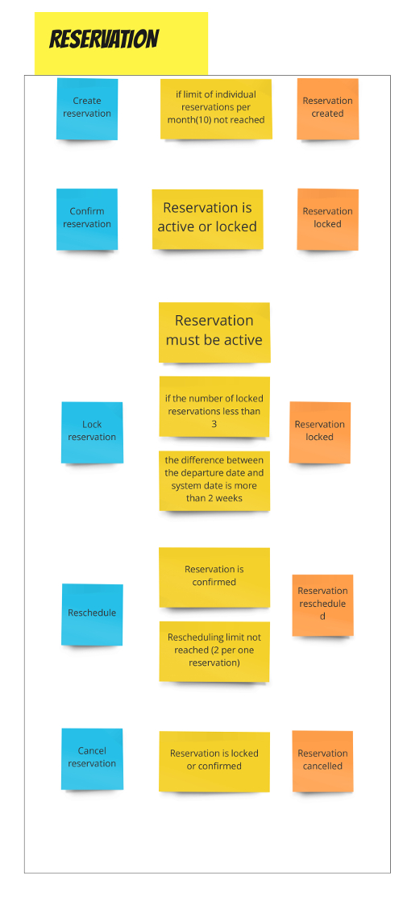
 
Based on this project, it is possible to prepare an aggregate implementation skeleton. In the implementation, each command is represented by a
 separate method, and each rule by its logic.

```java
public class Reservation {

    private static int TWO_WEEKS_DAYS = 14;
      private ReservationId id;
      private CustomerId customerId;
      private FligtId flightId;
      private LocalDateTime departureDate;
      private Money price;
    
      private CurrentlyLocked currentlyHolded;
      private ReservedThisMonth reservedThisMonth;
      private RescheduledSoFar rescheduledSoFar;
      private Status currentStatus;

   // BLUE CARD
    public Result activate() {
      if (reservedThisMonth.limitReached()) {
        return Result.failure();
      }      
      return Result.success();
    }
  
    // BLUE CARD
    public Result confirm() {
      if (!(isActive() || isLocked())) {
        return Result.failure();
      }      
      return Result.success();
    }
    // BLUE CARD
    public Result lock() {
      if (!isActive() || departureDateLessThan() || currentlyHolded.limitReached()) {
        return Result.failure();
      }      
      return Result.success();
    }
    // BLUE CARD
  
    public Result reschedule() {
      if (!isConfirmed() || rescheduledSoFar.limitReached()) {
        return Result.failure();
      }      
      return Result.success();
    }
    // BLUE CARD
  
    public Result cancel() {
      if (!(isLocked() || isConfirmed())) {
        return Result.failure();
      }      
      return Result.success();
    }
//private methods
}

``` 
#### Lack of Cohesion

At first glance you can see that the design of this class is not optimal. Class is too long. Has a lot of attributes. Some of them make sense only in a
 certain state. It's a code smells. 
  
Code analysis carried out by CodeMR confirms the problem. It showed a Lack of Cohesion for a Reservation class.  

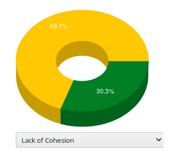

|Measure how well the methods of a class are related to each other. High cohesion (low lack of cohesion) tend to be preferable, because high cohesion is associated with several desirable traits of software including robustness, reliability, reusability, and understandability. In contrast, low cohesion is associated with undesirable traits such as being difficult to maintain, test, reuse, or even understand.LCOM (Lack of Cohesion of Methods): Measure how methods of a class are related to each other. Low cohesion means that the class implements more than one responsibility. A change request by either a bug or a new feature, on one of these responsibilities will result change of that class. Lack of cohesion also influences understandability and implies classes should probably be split into two or more subclasses. |
|--------|
    
    
**Domain Entity decomposition**    

I made an attempt to decompose the Reservation Entity. Decomposition is based on the possible entity states. Each state has its own representation. 

|The same Domain Entity can have many class representations.| 
|--------|

|Many Domain Entities can map to one database entity.|
|--------|


Many Domain Entities in the Reservation Aggregate:

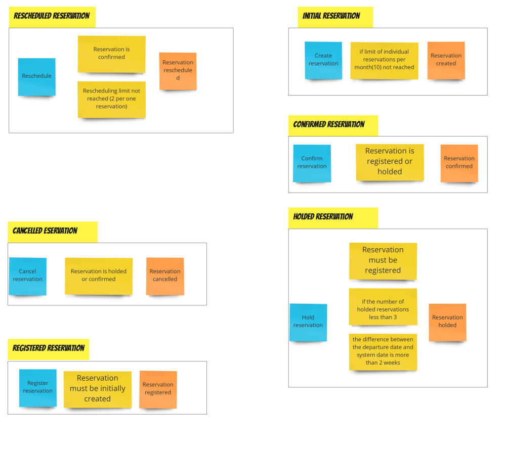

Now each object has a set of fields appropriate for a given transition.  

New objects ensure proper transition between states (by providing appropriate methods).

For example: REGISTERED reservation is able to change state to HOLDED or CONFIRMED.

```
               --> HOLDED
              |
REGISTERED -> |
              |
               --> CONFIRMED
```

The RegisteredReservation object provides two methods (*hold()* and *confirm()* respectively) returning Result.
             
```java
class RegisteredReservation implements IdentifiedReservation {
  //...

  public Result hold(int currentlyHolded) {
    return HoldedReservation.create(this, this.departureDate, currentlyHolded);
  }

  public Result confirm() {
    return ConfirmedReservation.create(this);
  }
}

```

When the result is successful, there is possible to get the right one specialization (reservation in new state). 

```
  @DisplayName("Should hold when number of holded reservations equals 2")
  @Test
  void shouldHoldWhenNumberOfLockedReservationsEquals2() {
    // given
    var registered = ReservationFixture.registeredWithDepartureDayFor3Weeks();
    var currentlyHolded = 2;
    // when
    var res = registered.hold(currentlyHolded);
    // then
    Assertions.assertThat(res.isSuccess()).isEqualTo(true);
    Assertions.assertThat(res.returned()).isExactlyInstanceOf(HoldedReservation.class);
  }

  @DisplayName("Should confirm when departure date more than 2 weeks")
  @Test
  void shouldConfirmWhenDepartureDateMoreThan2Weeks() {
    // given
    var registered = ReservationFixture.registeredWithDepartureDayFor3Weeks();

    // when
    var res = registered.confirm();
    // then
    Assertions.assertThat(res.isSuccess()).isEqualTo(true);
    Assertions.assertThat(res.returned()).isExactlyInstanceOf(ConfirmedReservation.class);
  }
```
Internal state checking methods *(isActive(),isConfirmed(),isHolded()...)* have become unnecessary. State is determined by the type of object.

Re-analysis of reservation model package showed significant improvement:

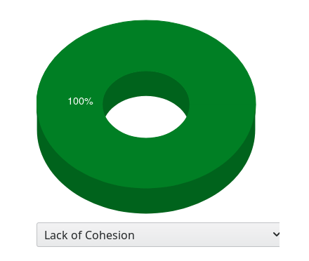


## Implementation (Reservation module)

The Reservation module is an example of a deep module. It has a large number of business rules. 
Some of them are quite complicated. 
According to ADR [Use Ports and Adapters architecture](ars/0003-TCH-RES-use-ports-and-adapters-architecture.md) module will be implemented in architecture
 Ports and Adapters (Hexagonal Architecture).

### Ports and Adapters (Hexagonal Architecture)

This type of architecture is dedicated for modules with high business complexity. 
It gives the opportunity to separate the most important business logic from application and infrastructure logic.  Thanks to this, each type of logic can be
tested independently.

The heart of the system is the domain model whose task is to implement core business rules. Domain model must be completely independent of the libraries used.

The application communicates with other parts of the system using the input ports (primary ports) and output ports (secondary ports).
Each port has a dedicated adapter whose task is to translate the model.

**In the real world, ports are interfaces. Their implementation is provided by the infrastructure layer.** 

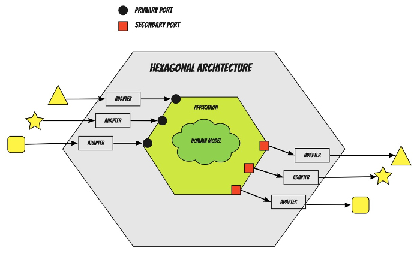

### Non-functional requirements

The module will be tested using three types of tests: 

- Unit Tests will be used to test business logic.  They will be made without access to the web layer and database.
- Acceptance Tests (integration tests)  will check the correctness of the business process. Require access to the database but
 are separated from the REST API layer. 
- Web API Tests will be used to check the REST API. They will be performed without access to the database and without interacting with the
  application layer.

According to notes:

- [Use relational database as a aggregate data repository](ars/0004-TCH-RES-use-relational-database-as-a-aggregate-data-repository.md)
- [Use Spring Repository](ars/0005-TCH-RES-use-spring-repository.md)

As a data storage relational database will be used.  Access to data will be provided by Spring Repository.  

The  reservation module will communicate with external components via the facade interface - *ReservationFascade* . Its implementation will be provided by a
 spring bean.  The interface can be injected into controllers and other application modules via Spring IoC. It will delegate calls to the module's internal services.

**No other interfaces can be used outside the module (and in REST controllers).**

### Application services

Application services are the bridge between domain model (and services) and infrastructure. They do not implement any business logic. Coordinate the
 invocation of the correct domain objects and provide the appropriate data. 
 
 Main application services are:
 
 - *ReservationFacade* - communicates with other parts of the system . 
 - *ReservationService* - delegates calls to the domain model .
 - *ReservationRepository* - acquires and saves data.
 
 Their implementations are spring beans placed in the infrastructure part.
 
 ReservationRepository has two different implementations:
 
 1. **InMemoryReservationRepository** - provides fast database functionality mainly for testing purposes. It will be be implemented based on a simple HashMap
 . Its use will allow to save and read data without having to raise real database context. It will be very fast.
    
 ```java
public class InMemoryReservationRepository implements ReservationRepository {
    Map<ReservationId, Reservation> cache=new HashMap<>();
}
```

2. **DefaultReservationRepository** - provides real access to data via Spring Data Repository. It translates the domain model into an entity model (and vice
 versa). Should be used in real, production implementation. 
 
```java
public class DefaultReservationRepository implements ReservationRepository {

    private ReservationRepositoryDB repositoryDB;

    public DefaultReservationRepository(ReservationRepositoryDB repositoryDB) {
        this.repositoryDB = repositoryDB;
    }
}
```
  
  |It should be noted that application services cannot use a model with infrastructure features (e.g. an entity model). This would kill the flexibility and testability of the application.|
  |------|
 

### Spring Boot Configuration

**It is important to follow two rules**

|Beans are only instigated in dedicated factories. Don't use any annotations used by the spring autoscan mechanism *(@Component,@Service)*.|
|:-------:|

|@Autowired annotation should be used only in tests (or nowhere). Injections should be realized via constructors!|
|:-------:|


The application can run in test and production mode. It is done by using two independent SpringBoot configurations.

1. Production configuration

```java
@SpringBootApplication
@Import(ReservationConfiguration.class)
public class ArsApplication {
    //...
}
```

```java
public class ReservationConfiguration {
  @Bean
  public ReservationRepository createRepository(ReservationRepositoryDB repoDB) {
    return new DefaultReservationRepository(repoDB);
  }

  @Bean
  public ReservationService createService(ReservationRepository repo) {
    return new DefaultReservationService(repo);
  }

  @Bean
  public ReservationFacade createFacade(ReservationService service) {
    return new DefaultReservationFacade(service);
  }

 /*
   Simplified implementation now.
 */
  @Bean
  DataSource dataSource() {
    return new EmbeddedDatabaseBuilder()
        .generateUniqueName(true)
        .setType(EmbeddedDatabaseType.HSQL)
        .addScript("reservation_create_schema.sql")
        .build();
  }
}
```

2. Test configuration

```java
@SpringBootTest(classes = ReservationInMemoryTestApplication.class)
class ReservationAcceptanceIT {
//...
}
```

```java
@SpringBootApplication
@Import(ReservationInMemoryTestConfiguration.class)
public class ReservationInMemoryTestApplication {
 //...
}
```

```java
@EnableAutoConfiguration(exclude = {DataSourceAutoConfiguration.class,
        DataSourceTransactionManagerAutoConfiguration.class,
        HibernateJpaAutoConfiguration.class,
        JpaRepositoriesAutoConfiguration.class})
public class ReservationInMemoryTestConfiguration {
  @Bean
  public ReservationRepository createRepository() {
    return new InMemoryReservationRepository();
  }

  @Bean
  public ReservationService createService(ReservationRepository repo) {
    return new DefaultReservationService(repo);
  }

  @Bean
  public ReservationFacade createFacade(ReservationService service) {
    return new DefaultReservationFacade(service);
  }
}
```

The *@SpringBootTest* annotation indicates an application prepared specifically for testing purposes *SpringBootApplication*.  
After loading it, engine does not try to search for other applications (that is why there are no conflicts in the definition of beans).  

*ReservationInMemoryTestApplication* loads own configuration *ReservationInMemoryTestConfiguration*.
This changes the standard SpringBoot behavior. Aspects of data access are excluded from the auto-configuration mechanism. 

Spring Factory provides *ReservationRepository* interface implementation, but does it differently than in production mode. 
It creates an instance and returns an object *InMemoryReservationRepository*. It does not inject spring data interface (in memory database
implementation doesn't need it), and there is no datasource configuration.  
 
At this moment the greatest advantage of hexagonal architecture is revealed. The same application is constructed in a completely different way. It gains new
behavior with no code changes.

Unit tests run completely outside the spring context and therefore do not require any special configuration. 
  
 ### Acceptance test
 
 The module implementation begins with creating an acceptance test. It checks the correctness of the module as a whole and tests the entire ticket reservation
 process. 

   |There is no need to test business rules at this stage. They have been checked by unit tests.|
   |:----------------:|
          
The acceptance test is more expensive than the unit test, it will operate on two elements :

- ReservationFacade - module entry point 
- Repository - database (injection is needed only to reset the state between tests)
   
The acceptance test is carried out in the Spring Context. 
     
#### From test to implementation

The acceptance test can be helpful when determining the module contract. Writing the test can be started when the interface has no methods yet. 

We can create the scenario steps, the IDE indicates the missing implementation elements. We refer to methods and objects that do not currently exist  in
 implementation.
 
For example, when holding a reservation, we call the *holdOn()* method, specifying its *HoldOnReservationCommand* object. Both the method and the command
 object do not currently exist. 

The same situation applies to the method of checking whether an object has been saved to the database *findByReservationId()*, and its
*FindByReservationIdCommnad*.

It should be noted that the persistance is also checked by facade method. If the object saved correctly, it must be found by id.
We do not check the existence of a record directly inside the database. We are examining the interface of the module and finding reservation is a valid business
 operation.

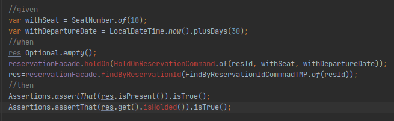

Then add the missing implementation elements (with active IDE support).

```java
public class HoldOnReservationCommand {
    private ReservationId reservationId;
    private SeatNumber seat;
    private LocalDateTime departureDate;

    private HoldOnReservationCommand(ReservationId reservationId, SeatNumber seat, LocalDateTime departureDate){
        this.reservationId=reservationId;
        this.seat = seat;
        this.departureDate = departureDate;
    }

    public static HoldOnReservationCommand of(ReservationId reservationId, SeatNumber withSeat, LocalDateTime withDepartureDate){
        return new HoldOnReservationCommand(reservationId,withSeat,withDepartureDate);
    }
}

```

```java
public class FindByReservationIdCommnad {
    private ReservationId reservationId;

    private FindByReservationIdCommnad(ReservationId reservationId){
        this.reservationId=reservationId;
    }

    public static FindByReservationIdCommnad of(ReservationId reservationId){
        return new FindByReservationIdCommnad(reservationId);
    }
}
```

```java
public interface ReservationFacade {
    void holdOn(HoldOnReservationCommand command);
    Optional<ReservationDTO> findByReservationId(FindByReservationIdCommnad command);
}
```
At the moment, only one method is missing to check the status of the returned object:

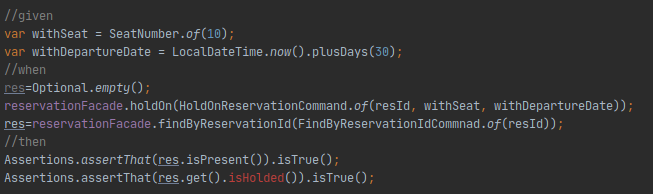

```java
@Value
public class ReservationDTO {
    private ReservationId reservationId;
    private StatusDTO status;
    private CustomerId customerId;
    private FligtId flightId;

    public boolean isHolded() {
        return status==StatusDTO.HOLDED;
    }

  
}
```

After adding it, the scenario step is completed, and the facade method contract is established.

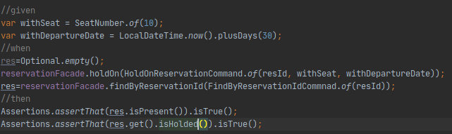

The same can be done for the other facade operations. 

In this way, a full acceptance test and all methods used in the booking process were created.

```java
@SpringBootTest(classes = ReservationInMemoryTestApplication.class)
class ReservationAcceptanceIT {

  @Autowired private ReservationFacade reservationFacade;

  @Autowired private InMemoryReservationRepository repository;

  @BeforeEach
  void clearRepository() {
    repository.clearAll();
  }

  @DisplayName("Should realize main ticket reservation process (create/register/hold/confirm/reschedule/cancel).")
  @Test
  void shouldRealizeMainReservationProcess() {
    var customerId = CustomerId.of(UUID.randomUUID());
    var flightId = FligtId.of(UUID.randomUUID());
    // given
    var resId = reservationFacade.create(CreateReservationCommand.of(customerId, flightId));
    // when
    var res = reservationFacade.findByFlightId(FindByFlightIdCommand.of(customerId, flightId));
    Assertions.assertThat(res.isPresent()).isTrue();
    Assertions.assertThat(res.get().isNew()).isTrue();

    res=Optional.empty();
    reservationFacade.register(RegistrationCommand.of(resId));
    res = reservationFacade.findByFlightId(FindByFlightIdCommand.of(customerId, flightId));
    Assertions.assertThat(res.isPresent()).isTrue();
    Assertions.assertThat(res.get().isRegistered()).isTrue();

    var withSeat = SeatNumber.of(10);
    var withDepartureDate = LocalDateTime.now().plusDays(30);
    res=Optional.empty();
    reservationFacade.holdOn(RegisterReservationCommnad.of(resId, withSeat, withDepartureDate));
    res=reservationFacade.findByReservationId(FindByReservationIdCommnad.of(resId));
    Assertions.assertThat(res.isPresent()).isTrue();
    Assertions.assertThat(res.get().isHolded()).isTrue();

    res=Optional.empty();
    reservationFacade.confirm(ConfirmationCommand.of(resId));
    res=reservationFacade.findByReservationId(FindByReservationIdCommnad.of(resId));
    Assertions.assertThat(res.isPresent()).isTrue();
    Assertions.assertThat(res.get().isConfirmed()).isTrue();

    var newFlightId = FligtId.of(UUID.randomUUID());
    var newSeatId = SeatNumber.of(11);
    var newDepartureTime = LocalDateTime.now().plusDays(15);
    var resheduledId = reservationFacade.reschedule(RescheduleCommand.of(resId, newFlightId, newSeatId, newDepartureTime));

    res=Optional.empty();
    res=reservationFacade.findByReservationId(FindByReservationIdCommnad.of(resId));
    Assertions.assertThat(res.isPresent()).isTrue();
    Assertions.assertThat(res.get().isRescheduled()).isTrue();

    res=Optional.empty();
    res=reservationFacade.findByReservationId(FindByReservationIdCommnad.of(resheduledId));
    Assertions.assertThat(res.isPresent()).isTrue();
    Assertions.assertThat(res.get().isConfirmed()).isTrue();

    reservationFacade.cancel(CancelByResrvationId.of(resheduledId));
    res=reservationFacade.findByReservationId(FindByReservationIdCommnad.of(resheduledId));
    Assertions.assertThat(res.isPresent()).isTrue();
    Assertions.assertThat(res.get().isCancelled()).isTrue();

  }
}

```

Of course, the test will fail because the facade has no implementation.

```java
public class DefaultReservationFacade implements ReservationFacade {

    private ReservationService service;

    public DefaultReservationFacade(ReservationService service) {
        this.service = service;
    }

    @Override
    public ReservationId create(CreateReservationCommand command) {
        return null;
    }

    @Override
    public Optional<ReservationDTO> findByFlightId(FindByFlightIdCommand command) {
        return Optional.empty();
    }

    @Override
    public void holdOn(HoldOnReservationCommand command) {

    }

    @Override
    public Optional<ReservationDTO> findByReservationId(FindByReservationIdCommnad command) {
        return Optional.empty();
    }

    @Override
    public void confirm(ConfirmationCommand command) {

    }

    @Override
    public ReservationId reschedule(RescheduleCommand of) {
        return null;
    }

    @Override
    public void cancel(CancelByResrvationId command) {

    }

    @Override
    public void register(RegistrationCommand command) {

    }
}
```

The test should be successful after implementing the application and domain functions.


### DDD building blocks

 